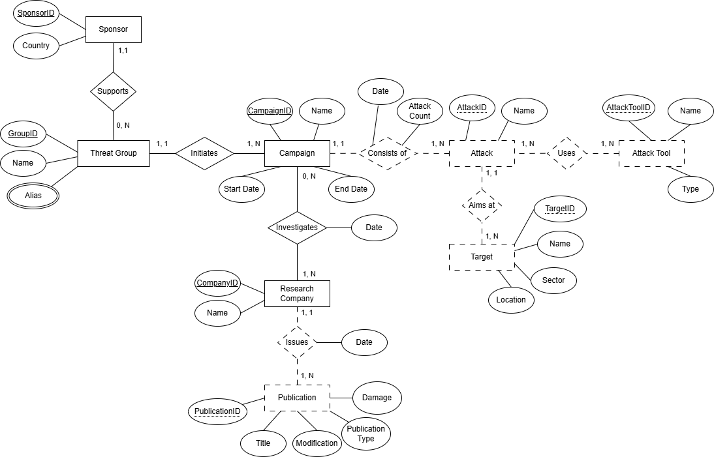

# CyberThreats Database Project

## Overview
This project is a **relational database** that models cyber threat intelligence. It tracks threat actors, their campaigns, attacks, tools, targets, and publications from research companies. The database is designed for educational purposes, demonstrating **relational modeling, foreign keys, and data integrity** in Microsoft SQL Server.

---

## Database Structure
The database contains the following tables:

| Table | Description |
|-------|-------------|
| **Sponsor** | Governments or organizations sponsoring threat groups (e.g., NSA, FSB) |
| **ThreatGroup** | Threat groups linked to sponsors (e.g., APT28, Lazarus) |
| **Alias** | Alternate names for threat groups |
| **TG_duplicate** | Threat groups that may represent the same entity |
| **Campaign** | Cyber campaigns conducted by threat groups |
| **Attack** | Individual attacks within campaigns, including financial damage |
| **AttackTool** | Tools, malware, or tactics used in attacks |
| **Uses** | Mapping of attacks to the tools they use |
| **Target** | Organizations or sectors targeted by attacks |
| **AimsAt** | Mapping of attacks to their targets |
| **ResearchCompany** | Companies that analyze and report on cyber threats |
| **Publication** | Reports created by research companies for campaigns/attacks |
| **About** | Maps campaigns to publications with dates |

> **Note:** This database demonstrates a complete many-to-many relational structure with foreign keys to ensure data integrity.

### ERD Diagram
The diagram below shows the structure of the CyberThreats database, including tables, relationships, and foreign key connections:



---
## Getting Started

1. Open **Microsoft SQL Server Management Studio (SSMS)**.
2. Run `create_tables.sql` to create the database schema.
3. Run `insert_data.sql` to populate the database with sample data.
4. Use queries to explore the database, e.g., find attacks by threat group or publications about campaigns.

```sql
-- List all campaigns and their threat groups
SELECT c.C_name, t.TG_name, s.S_name
FROM Campaign c
JOIN ThreatGroup t ON c.TG_name = t.TG_name
JOIN Sponsor s ON t.S_name = s.S_name;

-- Find all aliases for a threat group
SELECT Alias
FROM Alias
WHERE TG_name = 'APT28';

-- Find all attacks aimed at a specific target
SELECT a.A_name, t.T_name
FROM Attack a
JOIN AimsAt aa ON a.AttackID = aa.AttackID
JOIN Target t ON aa.TargetID = t.TargetID
WHERE t.T_name = 'NSA Servers';
```

---

## Notes

- The database enforces **foreign key constraints**, so inserts must respect table dependencies.
- `Alias` tracks alternate names; `TG_duplicate` tracks suspected duplicate groups.
- Financial damage values are stored as `DECIMAL(12,2)` for accuracy.

---

## Course Context

This project was completed as part of the Database Management course.
It demonstrates the application of:
- Relational database design
- Many-to-many relationships
- Foreign key constraints and data integrity
- Sample data generation and SQL querying

---

## Learning Objectives
- Design a normalized relational database
- Model complex relationships (threats ↔ campaigns ↔ attacks ↔ targets)
- Implement foreign keys and primary keys
- Populate the database with sample data while respecting constraints
- Write queries to analyze relationships between entities

---

## Future Enhancements
- Add more threat groups, campaigns, and attacks to expand the dataset
- Implement views or stored procedures for common queries
- Create dashboards or visualizations for cyber threat analytics
- Include more metadata on tools and campaigns for deeper analysis
